# summit log

## An android app to manage your Activities on your device without storage online

## Features:
* Manage your summits and bookmarks 
 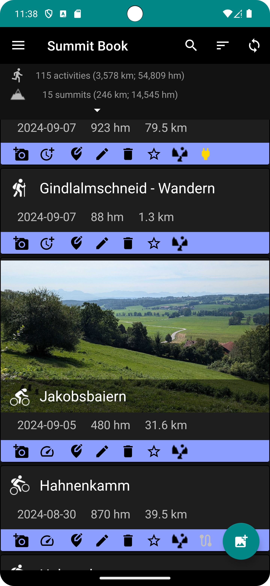
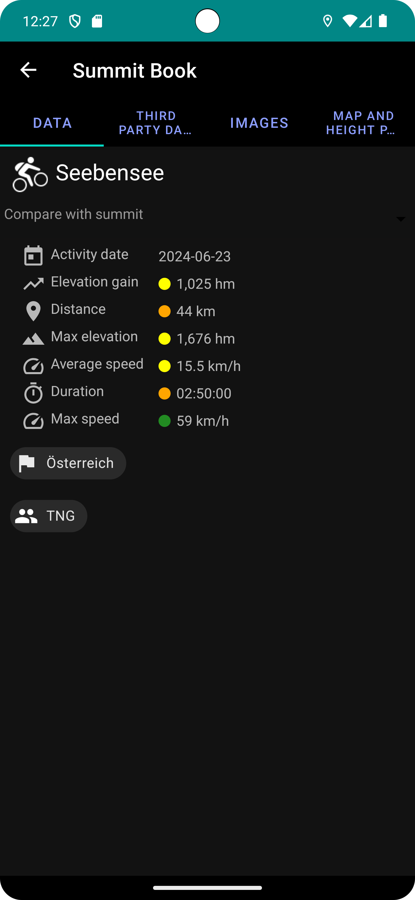
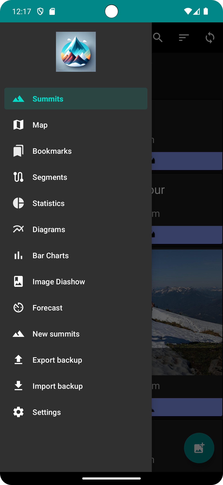
  * add images to summits
  * calculate statistics of your summit climb if you added a gpx file
     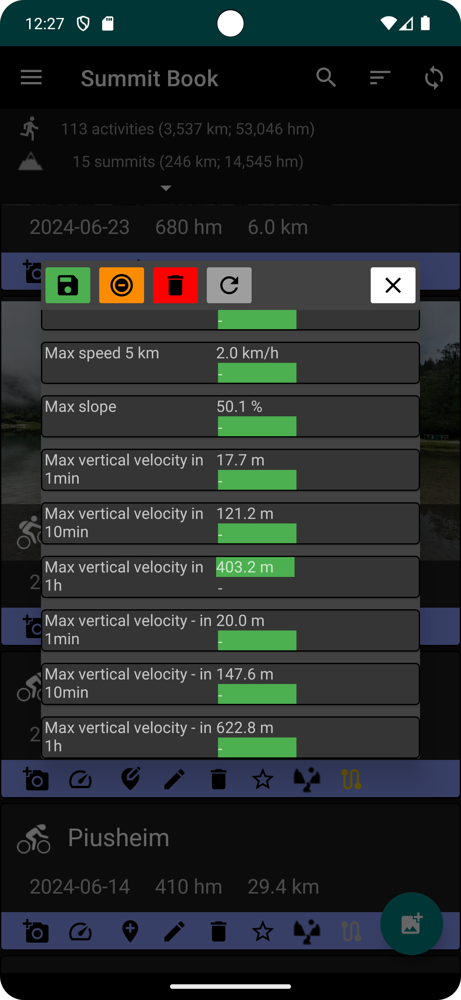
* Import zip file with your climbed summits
  * use "Export backup" to get a template of the zipped .csv file 
* Export zip file with details in CSV Format to view with LibraOffice
* Add Bookmarks for Summits you still want to climb
* Show statistics of all summits you climbed
 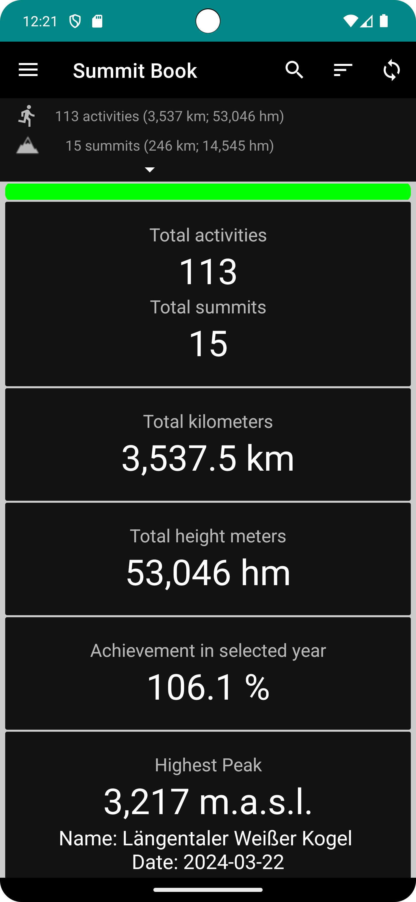
* Show plots of all summits you climbed
 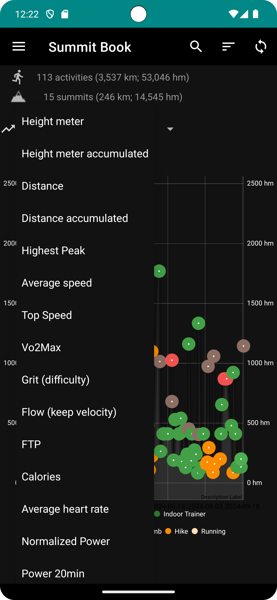
* Show bar graph with summary per time interval per sport type
 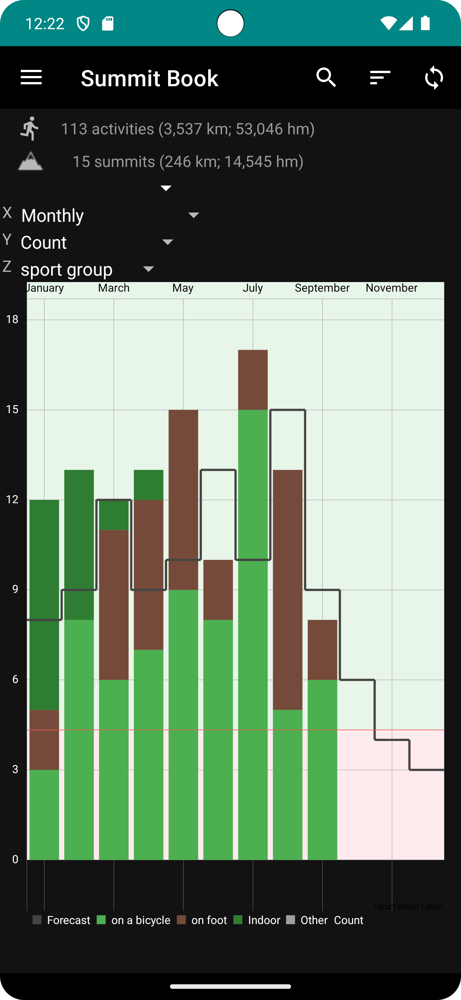
* Show all your summits and bookmarks on map
 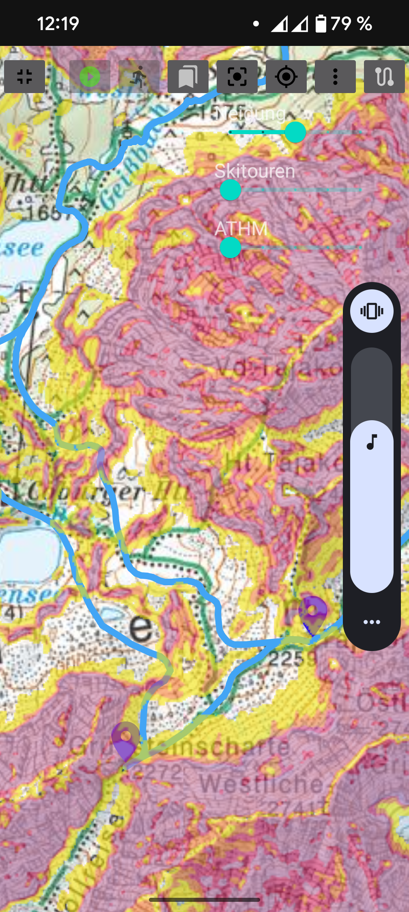
  * use offline maps and overlays (mbtiles and map)
     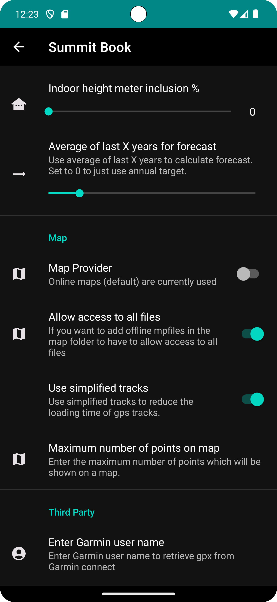
    * use https://info.skitourenguru.ch/index.php/swisstopo4guru for downloading topological maps/overlays in MapBoxTiles (.mbtiles) format
    * use https://www.openandromaps.org/en/downloads/ to download vector maps
    * if you want to use overlays you have to add them in a subfolder "overlays" of the selected map folder
    * if you only want to use ".map" files it is enough to allow access to the selected folder
    * if you want to use ".mbtiles" files you have to allow access to all files on your mobile phone
* View all your photos added to the summits
* Sort and filter your summits
   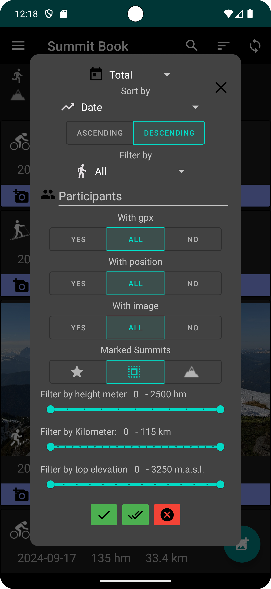

* Add estimates for climbed height meter, distance traveled and number of activities per year and check progress
  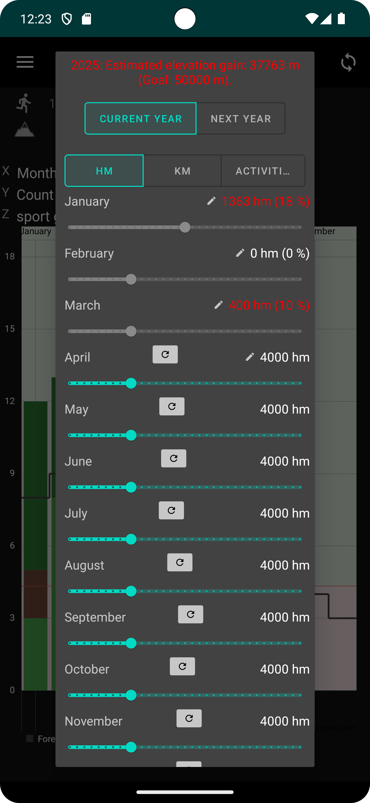
 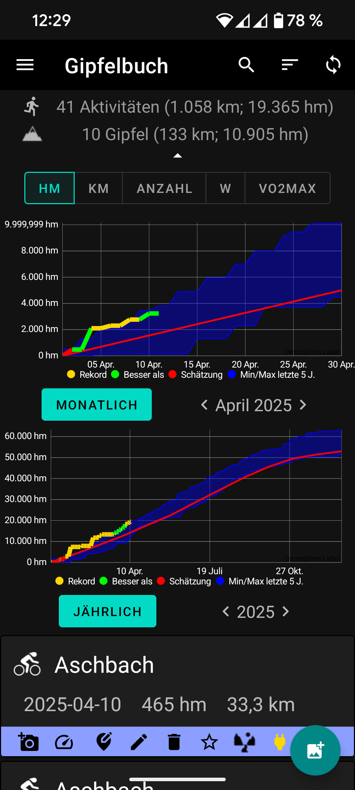
* Import tracks and data from Garmin Connect (second factor is supported)
 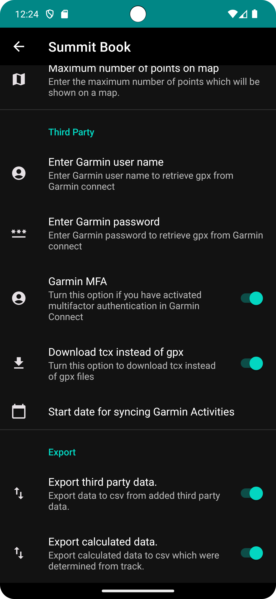
